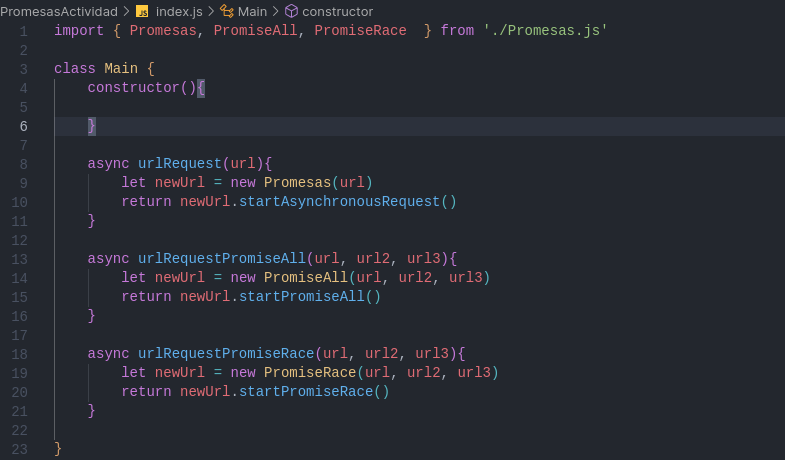
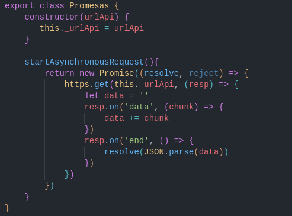
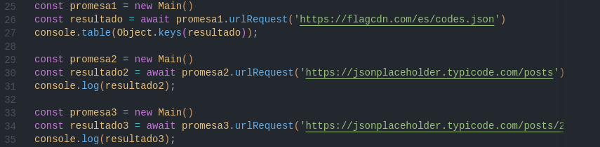
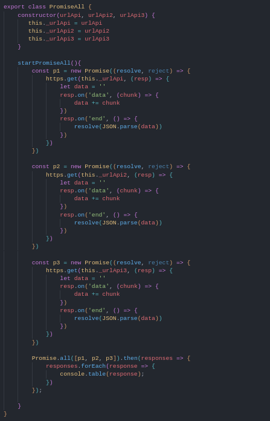
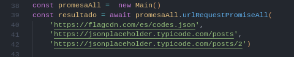
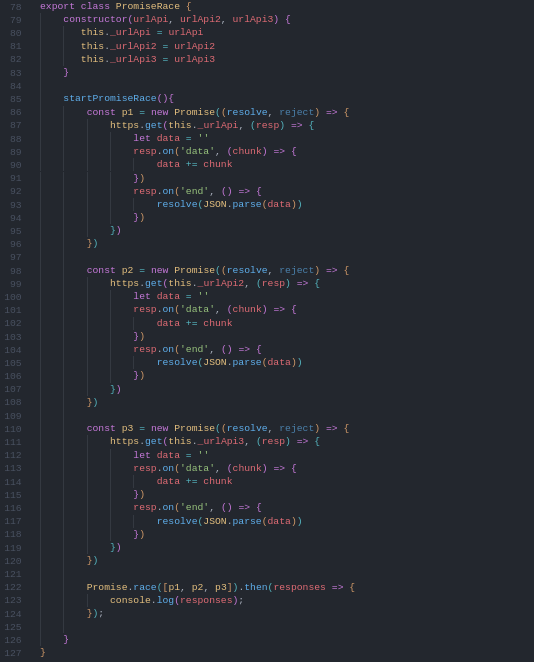

## Actividades dia 1

### Actividades de promesas

En esta actividad se realizo el uso de promesas y funciones como **async** y **await** 

1. Como punto de patida se creo una clase *Main* que se utiliza para inicializar la clase que se utilizo para cada iniciso de la practica.

2. Para el primer punto se creo un objeto de Promesas para enviar el URL y asi ya se tenia el objeto para mandar a ejecutar la promesa.

Clase Promesa

Llamda desde el *index.js*

3. Para el segundo punto se creo una clase que tambien construia e inicializaba un objeto con las 3 URL que seguidamente crea las promesa y por ultimo las ejecutaba con el metodo **all** 

Clase Promise All

Clase llamada desde el *index.js*

 

4. Por ultimo se creo una clase igual a la de Promise All que lo unico que cambiaba era el metodo que se ejecutaba

